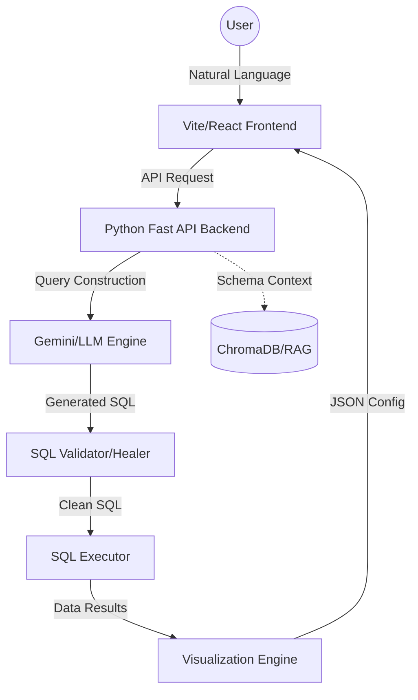

# 🚀 Prompt-to-SQL: AI-Powered BI Orchestrator

A production-grade, enterprise-ready platform that translates natural language into complex, optimized SQL queries with real-time interactive data visualizations.

---

## 🌟 Vision
Traditional Business Intelligence remains siloed behind technical barriers. **Prompt-to-SQL** democratizes data access by providing a seamless, chat-driven interface that architects SQL scripts, executes them securely, and converts raw numbers into actionable visual insights—all within seconds.

---

## ✨ Primary Capabilities

### 🧠 Intelligent Backend
*   **Semantic Mapping Layer**: Bridges natural language intent with relational database schemas.
*   **Self-Healing Logic**: Proactive query validation and automatic error correction for hallucinated joins or syntax issues.
*   **RAG-Enhanced SQL**: Uses vector store (ChromaDB) to inject business context into LLM prompts for higher accuracy.
*   **Hybrid Orchestration**: Stateless, modular pipeline with secure SQL execution and role-based access controls.

### 🎨 Premium Frontend
*   **Modern Chat UI**: ChatGPT-style conversational interface optimized for data scientists and stakeholders.
*   **Dynamic Response Cards**: Interactive dashboards featuring Recharts (Bar, Line, Pie) and sorted Data Tables.
*   **SQL Transparency**: Full visibility into the generated SQL with a built-in terminal-themed debugger.
*   **Enterprise Design**: Seamless Light/Dark mode support, glassmorphism aesthetics, and ultra-responsive layouts.

---

## 📁 Project Architecture



---

## 🛠️ Technology Stack

| Layer | Technologies |
| :--- | :--- |
| **Frontend** | React 19, Vite 6, Tailwind CSS V4, Recharts, Zustand, Framer Motion |
| **Backend** | Python 3.10+, LiteLLM, SQLAlchemy, Pydantic, Pandas |
| **Intelligence** | Google Gemini API, ChromaDB (Vector Search) |
| **Infrastructure** | PostgreSQL (Target DB), Supabase Auth |

---

## 🚀 Getting Started

### 📦 Prerequisites
*   [Node.js](https://nodejs.org/) (v20+)
*   [Python](https://www.python.org/) (v3.10+)
*   [PostgreSQL](https://www.postgresql.org/)

### 🔧 Installation & Setup

#### 1. Global Setup
Clone the repository and install root requirements:
```bash
pip install -r requirements.txt
```

#### 2. Backend Orchestration
Configure the AI engine:
```bash
cd backend
# Create .env based on .env.example
# Add GOOGLE_API_KEY and DB_URL
source .venv/bin/activate  # Or your venv activation command
python main.py
```

#### 3. Frontend Experience
Spin up the development server:
```bash
cd frontend
npm install
npm run dev
```

---

## 🏗️ Folder Structure
*   `backend/` - The core AI orchestration, semantic layer, and SQL execution logic.
*   `frontend/` - Modern React dashboard for data visualization and chat interaction.
*   `requirements.txt` - Python dependencies for the overall system.
*   `implementation.md` - Technical deep-dive and architectural decisions.

---

## 🛡️ Support & Security
Designed with **SQL injection protection** and **role-level security (RLS)** as first-class citizens. For sensitive data handling, please refer to the `auth/` and `validator/` modules in the backend.

---

*Professional AI Data Solutions | 2026 Production Ready*
